## Advanced Lane Finding

In this project, goal is to write a software pipeline to identify the lane boundaries in a video.

The Project
---

The goals / steps of this project are the following:

* Compute the camera calibration matrix and distortion coefficients given a set of chessboard images.
* Apply a distortion correction to raw images.
* Use color transforms, gradients, etc., to create a thresholded binary image.
* Apply a perspective transform to rectify binary image ("birds-eye view").
* Detect lane pixels and fit to find the lane boundary.
* Determine the curvature of the lane and vehicle position with respect to center.
* Warp the detected lane boundaries back onto the original image.
* Output visual display of the lane boundaries and numerical estimation of lane curvature and vehicle position.

### 1. Camera Calibration and Distortion Correction

Calibration of camera is required as the output of the camera with  lenses are always distorted. In order to undistort the image, the camera matrix and distortion co-efficients are needed to be computed. This is  done with the help of opencv API (cv2.calibrateCamera). In order to  calibrate the camera, different images of the same object - Chessboard  is taken from different angles. Luckily, for this project, those images  are already present in camera_cal directory. These images are used to  find the corners with cv2.findChessboardCorners API and then used to  pass to the calibrateCamera API to produce mtx and dist. This needs to  be calculated only once as they dont change. So, the values are stored  in the pickle files 'mtx.p' and 'dist.p'. If those pickle files are not  there, once the calibrate_undistort function is called, they are created and then the global variable mtx and dist are updated with it.

Using the obtained mtx and dist values, an image can be corrected from its distortion with the help of cv2.undistort API.

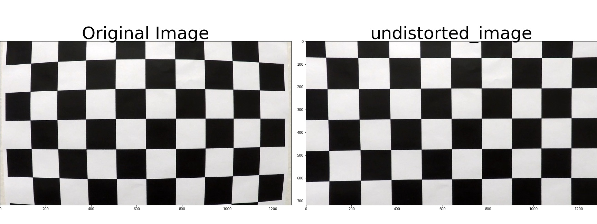

### 2. Thresholding

#### a. Gradient Thresholding

There are different ways to filter an image to look for only lane  lines, gradient thresholding is one of them. For absolute sobel  thresholding, it can be seen that the gradients taken in both the x and  the y directions detect the lane lines and pick up other edges. Taking  the gradient in the x direction emphasizes edges closer to vertical.  Alternatively, taking the gradient in the y direction emphasizes edges  closer to horizontal. However, just sobel thresholding is not enough as  it picks up many other edges as well. So, taking the magnitude of the  gradient and also the direction of the gradient is required.  Finally,  taking a combination of all these gradients by tweaking with the  threshold values, lanes were fairly detected. Except that the second  image, where the yellow lines are on the concrete road, none of the  threshold values could get those lines. So, a different strategy is  required to find those lines. The function "combined_gradient_threshold" creates a binary image by taking gradient threshold on sobelx, sobely,  magnitude and direction.

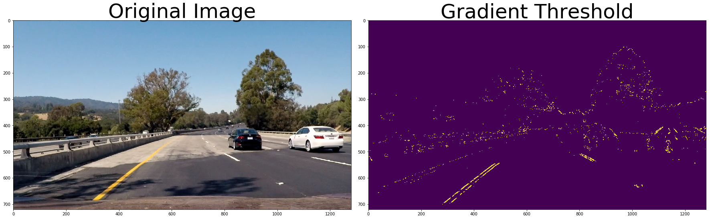

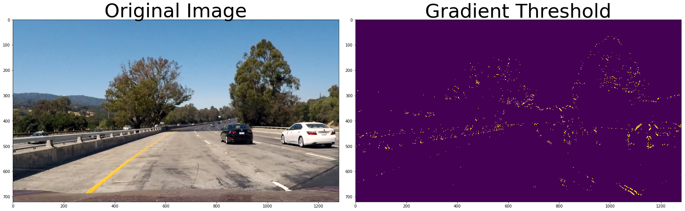

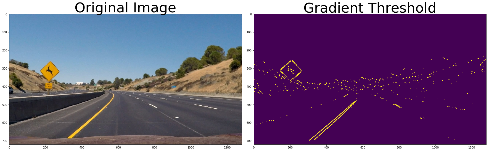

#### b. Color Transform

As the yellow lines on concrete road were not detectable with  gradient thresholding, we shall use the color space information to  detect those lines. With HLS color transform, the (s) saturation channel seemed to contain the relevant data. However, with just the s channel  it was not working for all the images, so HSV color transformation was  also considered. The value (v) channel of HSV also had relevant data.  So, a combination of these two transforms with a little tweaking of the  threshold values helped to identify lane lines for most of the images.  The function "combined_color_transform" provides a binary image by  combining the output of both HSV and HLS transforms.

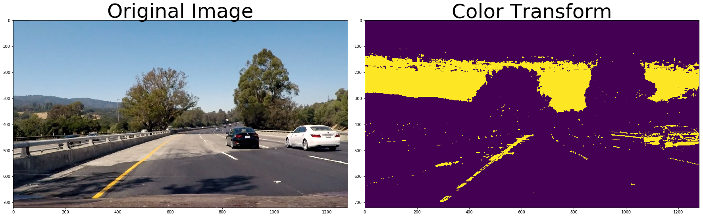

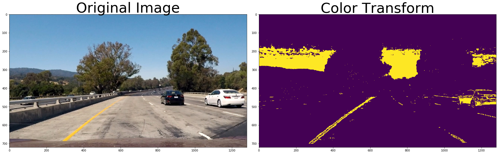

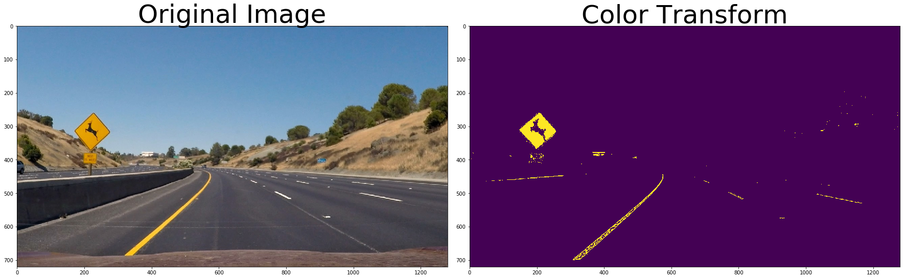

#### c. Combining Gradient and Color Transforms

Combining the output of both gradient and color transforms provided  the best results compared to just considering one of them. The function  "combined_gradient_and_color_threshold" takes in the image and outputs a binary image by using both gradient thresholding and color transform

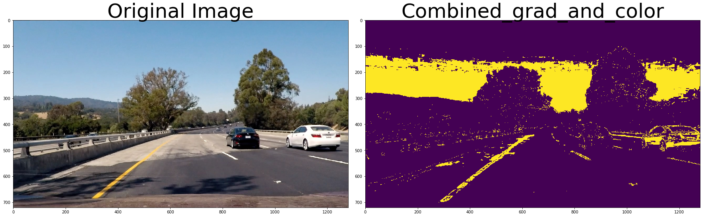

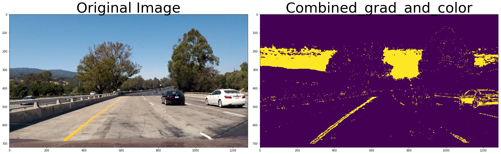

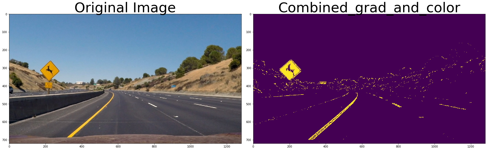

#### 3. Perspective Transform

A perspective transform maps the points in a given image to  different, desired, image points with a new perspective. The perspective transform that we are interested in is the bird’s-eye view transform  that let’s us view a lane from above. This si required as it helps us in calculating the lane curvature. In order to get the bird's eye view of  an image, transformation matrix is required and this can be obtained by  calling the OpenCV API cv2.getPerspectiveTransform. However, it requires source and destination points to find the transformation matrix. The  source points are chosen in a way that it represents a trapezoidal shape around the straight lane lines that would represent a rectangle when  looking down on the road from above. In the same way, the destination  points are chosen in a way that the straight lines can be covered by its bird's eye view. Each of these points are carefully looked at and  selected from the image with the help of plot graph. Once these array of points are formed, transformation matrix is then found with the help of cv2.getPerspectiveTransform and the inverse transformation matrix is  found by switching the dst and src points. Once the matrix is found, it  is then used to warp perspective to produce a warped image with the help of cv2.warpPerspective API. The matrices once found, will not hcange  much. So, a global variable tranform_mtx and inv_tranform_mtx holds the  matrix data which is used at a later point.

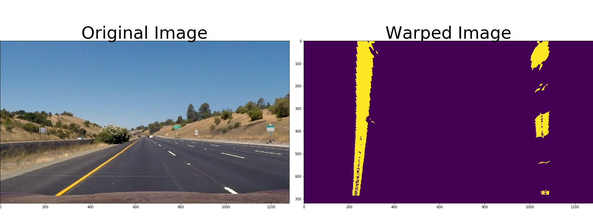

#### 4. Find Lanes and Measure Curvature

After the warped image is generated with only the lane lines, next  step is to simplify the pixel data to two polynomials - right and left  lane lines. In order to do that, a histogram of the bottom half of the  image is taken and its peak before the midpoint and after the midpoint  is found out. This peak is the left and right lane lines. A sliding  window is created for these lines with a defined margins and windows.  Once this is done, extract the x and y co -ordinates of these lines  which are then used to do a polynomial fit. Then generate x and y values for plotting which is finally used to create a pollygon to fit the  entire lane. The generated polygon is then colored red for our  convenience and then warped back to the original stage with the help of  inverse transformation matrix.

The x and y co-ordinates obtained from this is actually in pixel  space and it needs to be converted to real world space.  Considering with the US regulations where the lane is about 30 meters  long and 3.7 meters wide, the meters per pixel in x and y dimensions are defined as 3.7/700 and 30/720 respectively. With the help of these  values, we can obtain the real world space values as shown in the  function "measure_curvature_real". The curvature may vary slightly  between left and right curve, so taking an average felt to be more  effective. Also, the offset from the center is calulated by finding the  camera center and the image center and then multiplying with the  xm_per_pix as shown in the function "calculate_offset_and_add_text".  These values are then overlayed onto the image with the help of  cv2.putText API.

The radius of curvature at any point x of the function x=f(y) is given as follows: Rcurve =((1+(2Ay+B)^2)^3/2)/|2A| where A and B are coefficients of the second order polynomial

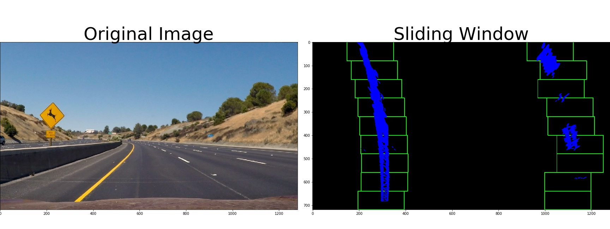

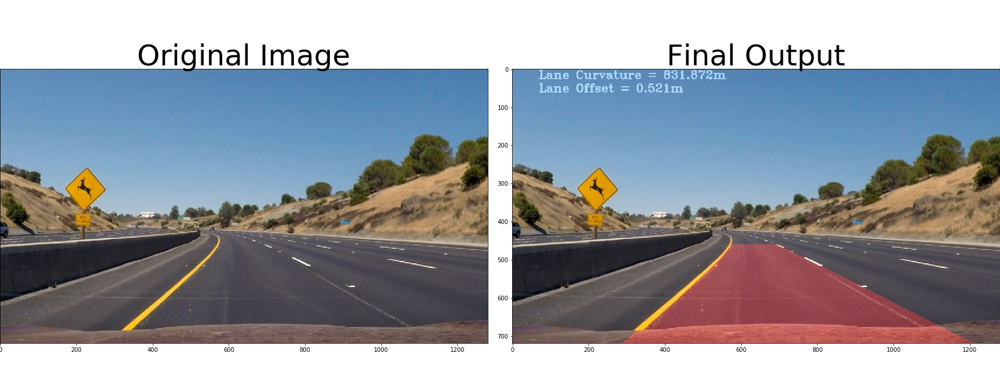

### Complete pipeline

The complete pipeline requires camera calibration, using the camera  matrix and distortion co-efficient to undistort the image, color  thresholding to obtain filtered lane image, warping the image with  transformation matrix to find histograms, sliding window approach to  find the lane lines, warping it back with inverse transformation matrix, finding the curvature and then combining this output with the original  image to produce the final output.

### Discussion

There are a lot of improvements which can be brought into the lane  finding technique. The color and gradient thresholding fails for  different shades of the same road as in challenge video. It shall also  fail for different weather like snow, rain. Also, the perspective  transform points chosen are manual and might work only for these roads,  however if there is something like s curved roads, perspective  transformation might fail. So, we need a dynamic way of finding those  points and the thresholding. Also, the sliding window approach is the  slowest and takes so much time to compute this entire video, but in real time we need answers very quickly. So, using search from prior approach  would make it much faster. There might be other approaches as well.