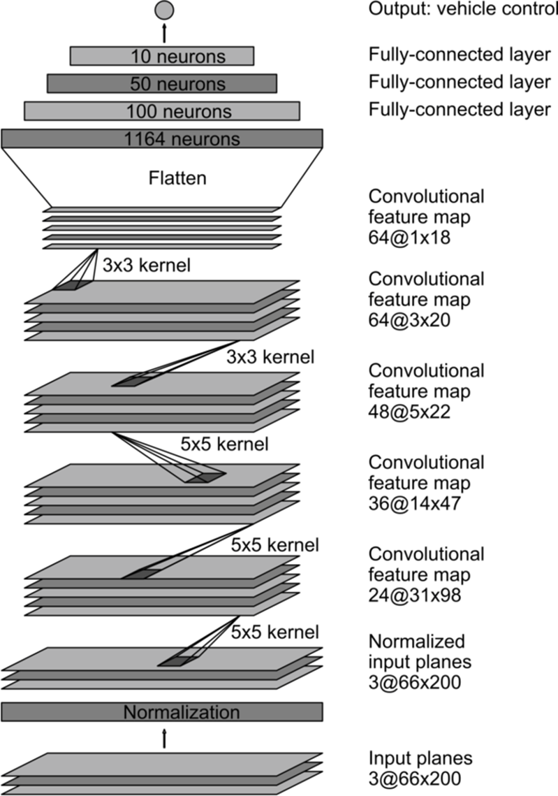
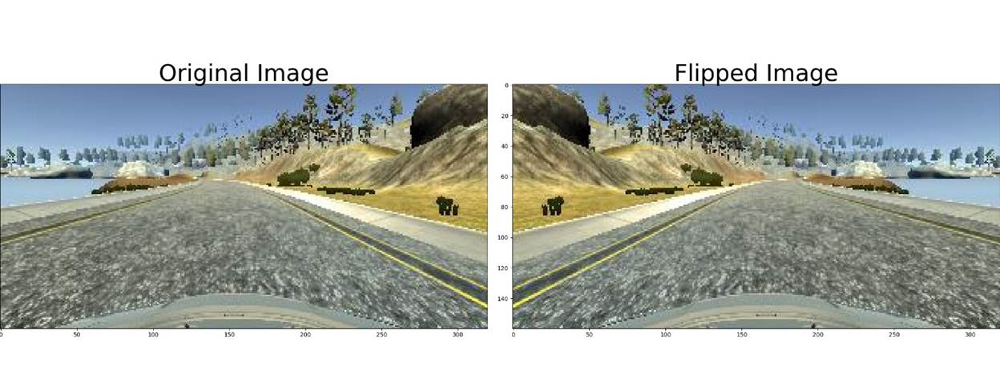
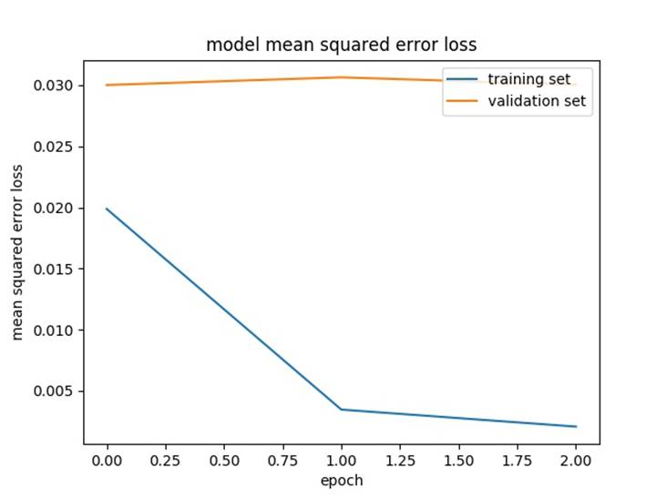

# Behavioral Cloning Project


Overview
---
This repository contains starting files for the Behavioral Cloning Project.

In this project, you will use what you've learned about deep neural networks and convolutional neural networks to clone driving behavior. You will train, validate and test a model using Keras. The model will output a steering angle to an autonomous vehicle.

We have provided a simulator where you can steer a car around a track for data collection. You'll use image data and steering angles to train a neural network and then use this model to drive the car autonomously around the track.

We also want you to create a detailed writeup of the project. Check out the [writeup template](https://github.com/udacity/CarND-Behavioral-Cloning-P3/blob/master/writeup_template.md) for this project and use it as a starting point for creating your own writeup. The writeup can be either a markdown file or a pdf document.

To meet specifications, the project will require submitting five files: 
* model.py (script used to create and train the model)
* drive.py (script to drive the car - feel free to modify this file)
* model.h5 (a trained Keras model)
* a report writeup file (either markdown or pdf)
* video.mp4 (a video recording of your vehicle driving autonomously around the track for at least one full lap)

This README file describes how to output the video in the "Details About Files In This Directory" section.

The Project
---
The goals / steps of this project are the following:
* Use the simulator to collect data of good driving behavior 
* Design, train and validate a model that predicts a steering angle from image data
* Use the model to drive the vehicle autonomously around the first track in the simulator. The vehicle should remain on the road for an entire loop around the track.
* Summarize the results with a written report

### Dependencies
This lab requires:

* [CarND Term1 Starter Kit](https://github.com/udacity/CarND-Term1-Starter-Kit)

The lab enviroment can be created with CarND Term1 Starter Kit. Click [here](https://github.com/udacity/CarND-Term1-Starter-Kit/blob/master/README.md) for the details.

The following resources can be found in this github repository:
* drive.py
* video.py
* writeup_template.md

The simulator can be downloaded from the classroom. In the classroom, we have also provided sample data that you can optionally use to help train your model.

## Details About Files In This Directory

### `drive.py`

Usage of `drive.py` requires you have saved the trained model as an h5 file, i.e. `model.h5`. See the [Keras documentation](https://keras.io/getting-started/faq/#how-can-i-save-a-keras-model) for how to create this file using the following command:
```sh
model.save(filepath)
```

Once the model has been saved, it can be used with drive.py using this command:

```sh
python drive.py model.h5
```

The above command will load the trained model and use the model to make predictions on individual images in real-time and send the predicted angle back to the server via a websocket connection.

Note: There is known local system's setting issue with replacing "," with "." when using drive.py. When this happens it can make predicted steering values clipped to max/min values. If this occurs, a known fix for this is to add "export LANG=en_US.utf8" to the bashrc file.

#### Saving a video of the autonomous agent

```sh
python drive.py model.h5 run1
```

The fourth argument, `run1`, is the directory in which to save the images seen by the agent. If the directory already exists, it'll be overwritten.

```sh
ls run1

[2017-01-09 16:10:23 EST]  12KiB 2017_01_09_21_10_23_424.jpg
[2017-01-09 16:10:23 EST]  12KiB 2017_01_09_21_10_23_451.jpg
[2017-01-09 16:10:23 EST]  12KiB 2017_01_09_21_10_23_477.jpg
[2017-01-09 16:10:23 EST]  12KiB 2017_01_09_21_10_23_528.jpg
[2017-01-09 16:10:23 EST]  12KiB 2017_01_09_21_10_23_573.jpg
[2017-01-09 16:10:23 EST]  12KiB 2017_01_09_21_10_23_618.jpg
[2017-01-09 16:10:23 EST]  12KiB 2017_01_09_21_10_23_697.jpg
[2017-01-09 16:10:23 EST]  12KiB 2017_01_09_21_10_23_723.jpg
[2017-01-09 16:10:23 EST]  12KiB 2017_01_09_21_10_23_749.jpg
[2017-01-09 16:10:23 EST]  12KiB 2017_01_09_21_10_23_817.jpg
...
```

The image file name is a timestamp of when the image was seen. This information is used by `video.py` to create a chronological video of the agent driving.

### `video.py`

```sh
python video.py run1
```

Creates a video based on images found in the `run1` directory. The name of the video will be the name of the directory followed by `'.mp4'`, so, in this case the video will be `run1.mp4`.

Optionally, one can specify the FPS (frames per second) of the video:

```sh
python video.py run1 --fps 48
```

Will run the video at 48 FPS. The default FPS is 60.

#### Why create a video

1. It's been noted the simulator might perform differently based on the hardware. So if your model drives succesfully on your machine it might not on another machine (your reviewer). Saving a video is a solid backup in case this happens.
2. You could slightly alter the code in `drive.py` and/or `video.py` to create a video of what your model sees after the image is processed (may be helpful for debugging).

### Model Architecture and Training Strategy

#### 1.   An appropriate model architecture has been employed

Initially I used LeNet architecture with 10 Epochs but the car was too much wavy going left and right even in a straight road, but still it was good enough to reach till the end. Anyways, I still created the Nvidia Autonomous Car Group model and the car drove completely fine through the first track with 3 epochs. 

LeNet’s architectural model summary is as follows:

_________________________________________________________________

Layer (type)         Output Shape       Param #  

=================================================================

lambda_1 (Lambda)      (None, 160, 320, 3)    0     

_________________________________________________________________

cropping2d_1 (Cropping2D)  (None, 90, 320, 3)    0     

_________________________________________________________________

conv2d_1 (Conv2D)      (None, 86, 316, 6)    456    

_________________________________________________________________

max_pooling2d_1 (MaxPooling2 (None, 43, 158, 6)    0     

_________________________________________________________________

conv2d_2 (Conv2D)      (None, 39, 154, 6)    906    

_________________________________________________________________

max_pooling2d_2 (MaxPooling2 (None, 19, 77, 6)     0     

_________________________________________________________________

flatten_1 (Flatten)     (None, 8778)       0     

_________________________________________________________________

dense_1 (Dense)       (None, 120)        1053480  

_________________________________________________________________

dense_2 (Dense)       (None, 84)        10164   

_________________________________________________________________

dense_3 (Dense)       (None, 1)         85    

_________________________________________________________________

dropout_1 (Dropout)     (None, 1)         0     

=================================================================

Total params: 1,065,091

Trainable params: 1,065,091

Non-trainable params: 0

_________________________________________________________________

None

 

Nvidia’s Autonomous car architectural model summary is as follows:

_________________________________________________________________

Layer (type)         Output Shape       Param #  

=================================================================

lambda_1 (Lambda)      (None, 160, 320, 3)    0     

_________________________________________________________________

cropping2d_1 (Cropping2D)  (None, 90, 320, 3)    0     

_________________________________________________________________

conv2d_1 (Conv2D)      (None, 43, 158, 24)    1824   

_________________________________________________________________

conv2d_2 (Conv2D)      (None, 20, 77, 36)    21636   

_________________________________________________________________

conv2d_3 (Conv2D)      (None, 8, 37, 48)     43248   

_________________________________________________________________

conv2d_4 (Conv2D)      (None, 6, 35, 64)     27712   

_________________________________________________________________

conv2d_5 (Conv2D)      (None, 4, 33, 64)     36928   

_________________________________________________________________

flatten_1 (Flatten)     (None, 8448)       0     

_________________________________________________________________

dense_1 (Dense)       (None, 100)        844900  

_________________________________________________________________

dense_2 (Dense)       (None, 50)        5050   

_________________________________________________________________

dense_3 (Dense)       (None, 10)         510   

_________________________________________________________________

dense_4 (Dense)       (None, 1)         11    

=================================================================

Total params: 981,819

Trainable params: 981,819

Non-trainable params: 0

_________________________________________________________________

None

#### 2.   Attempts to reduce overfitting in the model

Training and validation sets were used and was split as 80% and 20% respectively. LeNets architectural model was overfitting as the model’s training loss was very less while the validation loss was too high. So, I added a dropout with a rate of 0.5 to reduce overfitting. Also, I collected more data through the same track and places were the car was going over the ledges. Also, by augmenting the data/flipping the image, the collected data just got doubled. I even used the side images along with the center images with 0.2 as the correction factor. This also increased the number of samples/data.

#### 3.   Model parameter tuning

The model used an Adam optimizer, so the learning rate was not tuned manually. Also, below are the hyper parameters which I used to fine tune the model. 

\# Hyper parameters to fine tune

input_shape = (160, 320, 3)

num_of_epochs = 3

lenet_conv_filters = 6

lenet_conv_kernel_size = (5, 5)

dropout_rate = 0.5

validation_split = 0.2 # 20% Validation and 80% Training

correction_factor = 0.2

correction = [0.0, correction_factor, -correction_factor] # [center, left, right]

batch_size = 32 

#### 4.   Appropriate training data

I generated the training data by using the simulator. With just the first track dataset, the car couldn’t stay completely on the road as it went directly to the lake. So, I took more data in those areas where there are curves and where I felt that the car might go over the ledge. With the help of augmented data and side images, there were more data which helped the model to learn more. However, this led to overfitting the model and I had to use dropout to bring out a better model. 

### More Explanation

#### 1.   Solution Design Approach

My first step was to try the LeNet(http://yann.lecun.com/exdb/lenet/) model with 10 epochs and the training data obtained by driving properly in the center of the road. But the car went straight to the lake. Anyways, I included some data preprocessing by normalizing the data and then cropping the top and bottom of each image. However, even the data preprocessing did not help completely as it went directly to the second lake. Looking at the training and validation loss, I realized that the model is overfitting and added a dropout layer as well. The model got better but still couldn’t make it till the end of the track. Finally, I generated some more training data, but this time I generated data from places where the car was making mistake by teaching it to swerve better while it is just about to roll over the ledge. This helped a lot as the model learned to escape during those situations and could complete the track properly. But the car was completely shaky/swervy throughout the track as I think the model keeps on predicting left and right even though it is a straight road. So, I started exploring Nvidia’s architectural model and once I added that model and used the same datasets to train, the car could completely go till the end of the track with not that much wavy. So, the person sitting in that car would definitely experience a pleasant drive. 

#### 2.   Final Model Architecture

The model architecture which was chosen is Nvidia Autonomous car Group’s architectural model and is shown in the below image:



Taken from https://devblogs.nvidia.com/deep-learning-self-driving-cars/

The summary of the model which I used was explained earlier in the 1st point.

#### 3.   Creation of the Training Set & Training Process

To have more data, data was augmented/flipped, thus helping the car not to be left biased always. Below is an example image used to obtain a flipped image.

Apart from flipping the image, the side images along with center images were used with a correction factor of 0.2. This along with augmenting, gave about 21432 samples.

All these data was used for training the model with three epochs. The data was shuffled randomly. The following picture visualizes the mean squared error loss vs epoch for both training and validation set:

#### 4.   Code Explanation:

 \# Enabling/Disabling switches

ENABLE_SIDE_IMAGES = 1

ENABLE_FLIPPING_IMAGES = 1

ENABLE_PICKLE = 1

ENABLE_FOR_PC = 1

 

Above are switches to enable or disable it. Only with ENABLE_SIDE_IMAGES and ENABLE_FLIPPING_IMAGES being set, I could get a better accuracy. Also, I used Pickle file to work locally in my laptop while training the model as it was faster to load from a pickle file rather than parsing the csv file and then augmenting and adding the images/measurements to the list. This can be enabled by setting ENABLE_PICKLE which will check for “images.p” or “measurements.p” and if either of them is not found, it creates them from scratch. ENABLE_FOR_PC switch is required to set the image path while training the model in my laptop and it needs to be disabled while training in the workspace.

 

“create_model” is the function which takes in the samples and the type of model (‘LeNet’ or ‘Nvidia’). Based on the type, the appropriate model is created, compiled and saved as my_model_LeNet.h5 or my_model_Nvidia.h5. The model which I have submitted is obtained from Nvidia’s model as the name says. Also, generator with batch size of 32 were used to generate the training and validation samples required for the model.

Also, the directory “working_model” has all the different models I tried and found to be working for the first track.