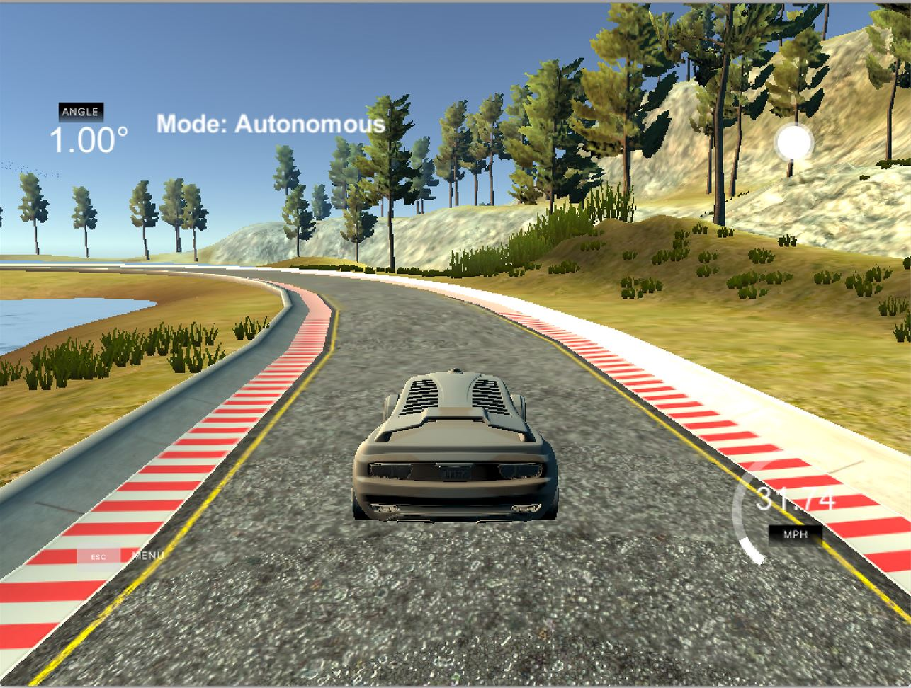

# CarND-Controls-PID
Self-Driving Car Engineer Nanodegree Program



---

## The PID Components

The controller computes the control commands using an observed error based on the following three components:

1. **The proportional (P) component:** Acts proportionally to the observed  error value. This means that larger the error value, the larger the absolute control command value. With Just P component, the vehicle shall oscillate a lot making it uncomfortable for the passengers.
2. **The integral (I) component:** A component which acts using the sum of all past observed  errors. This means that greater the past observed errors, the larger the absolute control command value. This component helps in case of systematic bias like a mechanical error in steering angle setup which leads to slowly drift away.
3. **The differential (D) component:** A component which acts based on the change in rate of the error. This means that more the error changes between the last and the current  time step, the larger the absolute control command value. This component is required to reduce the oscillation caused by P component and to make it smooth by providing a counter steer.


## Finding the PID Coefficients for the steering control

There are many methods to find the PID coefficients, but I started with the initial value given in the lecture where Kp = 0.2, Ki = 0.004 and Kd = 3.0. With these numbers, the vehicle was oscillating a lot but was a good value to start tuning with.

I started tuning with the help of Twiddle method where it changes the parameters based on the total error caused with that parameter value and then try to narrow down to a range which works well. With this method, I got a decent range of good values for each of the coefficients.

Using the range obtained from Twiddle method, I started doing the manual tuning to find the best parameter and came up with the final values to be

```
Kp = 0.1004, Ki = 0.0001 and Kd = 2.85
```


## Effect of each coefficient

When only Proportional component was used, that means when both Ki and Kd was made to 0, the vehicle was trying to go to the center and then was oscillating a lot as it was overshooting and then finally went off the ledge.

When only the integral component was used, that means when both Kp and Kd was made to 0, it will try to eliminate a possible bias on the controlled system that could prevent the error to be eliminated. But with only Ki, it makes the car to  go in circles. 

When only the Differential component was used, that means when both Kp and Ki was made to 0, it will try to counteract the proportional component. But as it Kp is 0, it tends to overshoot and go over the ledge.

## Steps for building the project

### Dependencies

* cmake >= 3.5
 * All OSes: [click here for installation instructions](https://cmake.org/install/)
* make >= 4.1(mac, linux), 3.81(Windows)
  * Linux: make is installed by default on most Linux distros
  * Mac: [install Xcode command line tools to get make](https://developer.apple.com/xcode/features/)
  * Windows: [Click here for installation instructions](http://gnuwin32.sourceforge.net/packages/make.htm)
* gcc/g++ >= 5.4
  * Linux: gcc / g++ is installed by default on most Linux distros
  * Mac: same deal as make - [install Xcode command line tools]((https://developer.apple.com/xcode/features/)
  * Windows: recommend using [MinGW](http://www.mingw.org/)
* [uWebSockets](https://github.com/uWebSockets/uWebSockets)
  * Run either `./install-mac.sh` or `./install-ubuntu.sh`.
  * If you install from source, checkout to commit `e94b6e1`, i.e.
    ```
    git clone https://github.com/uWebSockets/uWebSockets 
    cd uWebSockets
    git checkout e94b6e1
    ```
    Some function signatures have changed in v0.14.x. See [this PR](https://github.com/udacity/CarND-MPC-Project/pull/3) for more details.
* Simulator. You can download these from the [project intro page](https://github.com/udacity/self-driving-car-sim/releases) in the classroom.

Fellow students have put together a guide to Windows set-up for the project [here](https://s3-us-west-1.amazonaws.com/udacity-selfdrivingcar/files/Kidnapped_Vehicle_Windows_Setup.pdf) if the environment you have set up for the Sensor Fusion projects does not work for this project. There's also an experimental patch for windows in this [PR](https://github.com/udacity/CarND-PID-Control-Project/pull/3).

### Basic Build Instructions

1. Clone this repo.
2. Make a build directory: `mkdir build && cd build`
3. Compile: `cmake .. && make`
4. Run it: `./pid`. 

Tips for setting up your environment can be found [here](https://classroom.udacity.com/nanodegrees/nd013/parts/40f38239-66b6-46ec-ae68-03afd8a601c8/modules/0949fca6-b379-42af-a919-ee50aa304e6a/lessons/f758c44c-5e40-4e01-93b5-1a82aa4e044f/concepts/23d376c7-0195-4276-bdf0-e02f1f3c665d)

## Arguments taken by the program

If no arguments are given while running the program like ./pid then it will take the tuned parameters which are in PID.h.

In case you want to fine tune, then use the below arguments based on what you want to tune:

1. First argument: Value for Kp
2. Second argument: Value for Ki
3. Third argument: Value for Kd
4. Fourth argument: Type 0 for this to run the program without twiddle and by considering the new coefficient value mentioned before in the other arguments. Type any number other than 0 to run twiddle method to find the range of values and the init value for coefficients will be considered from the other arguments
5. Fifth argument: number of iteration after which the twiddle should run, find the new parameter value and then reset
6. Sixth argument: Coefficient which you want to tune. Type either "Kp" or "Ki" or "Kd"