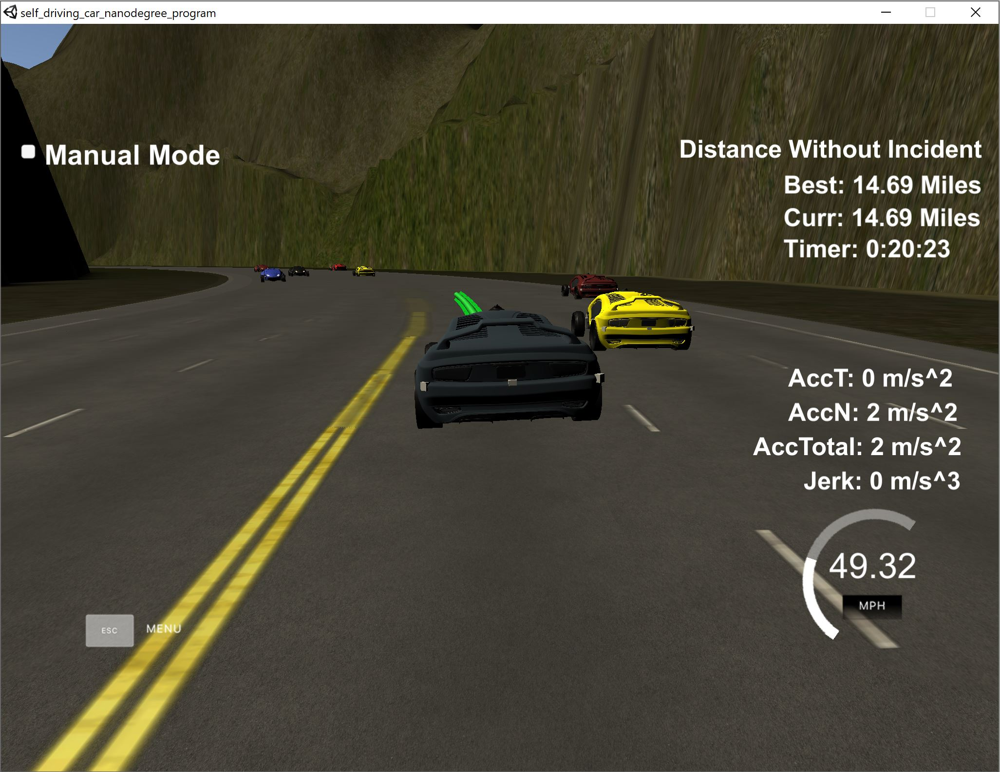

# CarND-Path-Planning-Project
Self-Driving Car Engineer Nanodegree Program



### Simulator.
You can download the Term3 Simulator which contains the Path Planning Project from the [releases tab (https://github.com/udacity/self-driving-car-sim/releases/tag/T3_v1.2).  

To run the simulator on Mac/Linux, first make the binary file executable with the following command:
```shell
sudo chmod u+x {simulator_file_name}
```

### Goals
In this project, the goal is to safely navigate around a virtual highway with other traffic that is driving +-10 MPH of the 50 MPH speed limit. You will be provided the car's localization and sensor fusion data, there is also a sparse map list of waypoints around the highway. The car should try to go as close as possible to the 50 MPH speed limit, which means passing slower traffic when possible, note that other cars will try to change lanes too. The car should avoid hitting other cars at all cost as well as driving inside of the marked road lanes at all times, unless going from one lane to another. The car should be able to make one complete loop around the 6946m highway. Since the car is trying to go 50 MPH, it should take a little over 5 minutes to complete 1 loop. Also the car should not experience total acceleration over 10 m/s^2 and jerk that is greater than 10 m/s^3.

#### The map of the highway is in data/highway_map.txt
Each waypoint in the list contains  [x,y,s,dx,dy] values. x and y are the waypoint's map coordinate position, the s value is the distance along the road to get to that waypoint in meters, the dx and dy values define the unit normal vector pointing outward of the highway loop.

The highway's waypoints loop around so the frenet s value, distance along the road, goes from 0 to 6945.554.

## Basic Build Instructions

1. Clone this repo.
2. Make a build directory: `mkdir build && cd build`
3. Compile: `cmake .. && make`
4. Run it: `./path_planning`.

Here is the data provided from the Simulator to the C++ Program

#### Main car's localization Data (No Noise)

["x"] The car's x position in map coordinates

["y"] The car's y position in map coordinates

["s"] The car's s position in frenet coordinates

["d"] The car's d position in frenet coordinates

["yaw"] The car's yaw angle in the map

["speed"] The car's speed in MPH

#### Previous path data given to the Planner

//Note: Return the previous list but with processed points removed, can be a nice tool to show how far along
the path has processed since last time. 

["previous_path_x"] The previous list of x points previously given to the simulator

["previous_path_y"] The previous list of y points previously given to the simulator

#### Previous path's end s and d values 

["end_path_s"] The previous list's last point's frenet s value

["end_path_d"] The previous list's last point's frenet d value

#### Sensor Fusion Data, a list of all other car's attributes on the same side of the road. (No Noise)

["sensor_fusion"] A 2d vector of cars and then that car's [car's unique ID, car's x position in map coordinates, car's y position in map coordinates, car's x velocity in m/s, car's y velocity in m/s, car's s position in frenet coordinates, car's d position in frenet coordinates. 

## Details

1. The car uses a perfect controller and will visit every (x,y) point it recieves in the list every .02 seconds. The units for the (x,y) points are in meters and the spacing of the points determines the speed of the car. The vector going from a point to the next point in the list dictates the angle of the car. Acceleration both in the tangential and normal directions is measured along with the jerk, the rate of change of total Acceleration. The (x,y) point paths that the planner recieves should not have a total acceleration that goes over 10 m/s^2, also the jerk should not go over 50 m/s^3. (NOTE: As this is BETA, these requirements might change. Also currently jerk is over a .02 second interval, it would probably be better to average total acceleration over 1 second and measure jerk from that.

2. There will be some latency between the simulator running and the path planner returning a path, with optimized code usually its not very long maybe just 1-3 time steps. During this delay the simulator will continue using points that it was last given, because of this its a good idea to store the last points you have used so you can have a smooth transition. previous_path_x, and previous_path_y can be helpful for this transition since they show the last points given to the simulator controller with the processed points already removed. You would either return a path that extends this previous path or make sure to create a new path that has a smooth transition with this last path.

## Tips

A really helpful resource for doing this project and creating smooth trajectories was using http://kluge.in-chemnitz.de/opensource/spline/, the spline function is in a single hearder file is really easy to use.

---

## Dependencies

* cmake >= 3.5
  
  * All OSes: [click here for installation instructions](https://cmake.org/install/)
* make >= 4.1
  * Linux: make is installed by default on most Linux distros
  * Mac: [install Xcode command line tools to get make](https://developer.apple.com/xcode/features/)
  * Windows: [Click here for installation instructions](http://gnuwin32.sourceforge.net/packages/make.htm)
* gcc/g++ >= 5.4
  * Linux: gcc / g++ is installed by default on most Linux distros
  * Mac: same deal as make - [install Xcode command line tools]((https://developer.apple.com/xcode/features/)
  * Windows: recommend using [MinGW](http://www.mingw.org/)
* [uWebSockets](https://github.com/uWebSockets/uWebSockets)
  * Run either `install-mac.sh` or `install-ubuntu.sh`.
  * If you install from source, checkout to commit `e94b6e1`, i.e.
    ```
    git clone https://github.com/uWebSockets/uWebSockets 
    cd uWebSockets
    git checkout e94b6e1
    ```

## Project Rubric

```
Project Rubric can be found here in this [link] (https://review.udacity.com/#!/rubrics/1971/view)
```

## Reflection

There is a new include file "spline.h" which has been added based on the explanation given the project Q&A video. Apart from that, the core logic remains in main.cpp and the helper function remains in helpers.h. 

In order to achieve the goal, the code can be separated into three different categories:

### Prediction [line 128 to line 163](./src/main.cpp#L128)
This is where we use the sensor fusion data to know where every other car is with respect to our self driving car. In the same way, we will need to predict where the car will be in the future, if we have to make any decision with respect to our car. This is done in [line 137](./src/main.cpp#L137). Also, I am using 3 different flags (left_lane_car_too_close, middle_lane_car_too_close and right_lane_car_too_close) to know if the car is too close to make a lane change or to slow down. Based on these flags, further decision is taken.
A new helper function checkLaneSafety is added which checks if it is safe enough to make a lane change and then sets the flag accordingly. However, this is done based on the tunable parameters mentioned in [line 12](./src/helpers.cpp#L12)

### Behavior [line 165 to line 243](./src/main.cpp#L165)
This is where the decision is made if the car has to stay in the same lane or change to a different lane or slow down. This part of the code is pretty self explanatory and there are comments added to understand what is done in that scope. Again, tunable parameters are very helpful and currently have tuned to an optimum solution. This can be changed further to make it more aggressive or faster. Also, there is another part added here, the car is made to stay in the left most lane as much as possible because we are always trying to run it close to the maximum speed limit and it makes sense to be on left most lane or else we will be blocked by a slow moving car in other lanes. 

### Trajectory [line 248 to line 351](./src/main.cpp#L248)
This category is very important as it does the calculation of the trajectory based on the speed, lane output from the behavior, car coordinates and previous path points.

Most of this part of code is taken from the project Q&A video and spline is used to smoothen the path. Also, it is good to note that most of the calculation are done based on the transformed and rotated points to local car coordinates and then it is transformed back to global coordinates. The speed change decided by the behavior part is used in this part to increase/decrease the speed on every trajectory points instead of doing it for the complete trajectory. Finally, the values going to next_x_vals and next_y_vals are what is received by the simulator to know where the car should be moved to.

It is interesting to note that I left the simulator running for a long time and found that the car did not face any incidents even after moving for about 15 miles as shown above in the image.